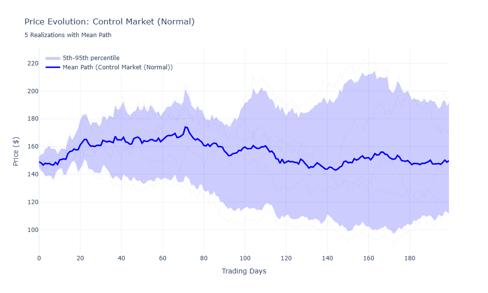
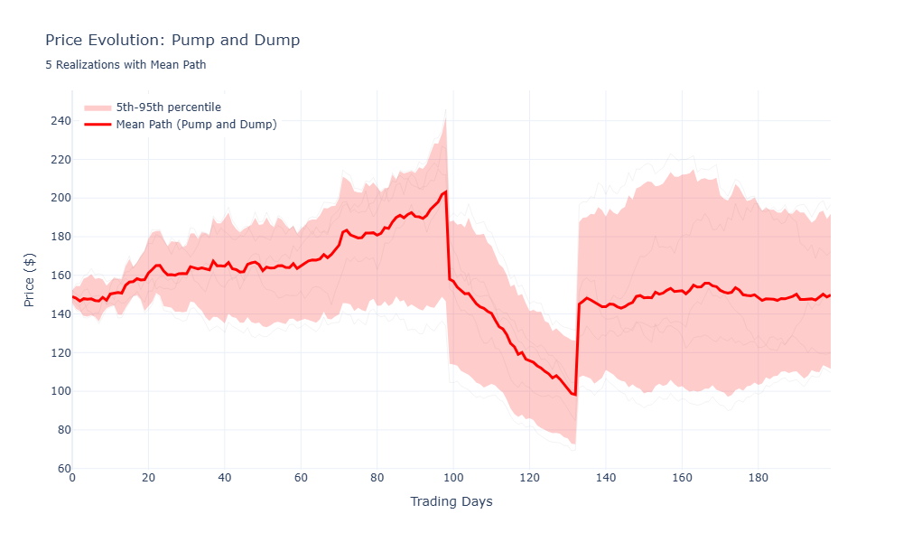
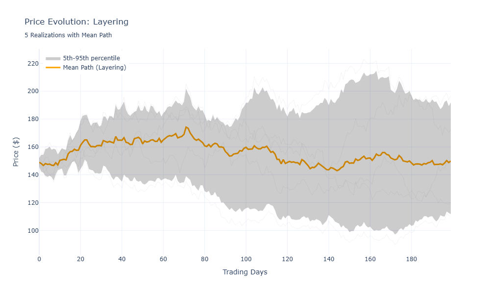

# MMSim: Market Manipulation Simulation in Python

**Note: This project is currently in development. More details to come next!**

A Python based market manipulation simulation strongly inspired by [braintruffle's video](https://www.youtube.com/watch?v=-jF9gW2r_bk)

## Installation

```bash
uv sync
source .venv/bin/activate  # On Windows: .venv\Scripts\activate
```

## Usage

The main application demonstrates our topological data analysis pipeline for market manipulation detection:

```python
# Main workflow from src/main.py
def main():
    # 1. Import historical price data
    data = import_price_historical("AAPL")
    
    # 2. Extract closing prices and embed in higher dimensional space
    ts = data["Close"].values
    ts_embedded = persistence_homology.embed_time_series(ts)
    
    # 3. Reduce dimension if needed for visualization
    if ts_embedded.shape[1] > 3:
        ts_embedded = persistence_homology.reduce_dimension(ts_embedded)
    
    # 4. Visualize the embedded time series
    persistence_homology.plot_pcd(ts_embedded, "embedded_ts_AAPL")
    
    # 5. Compute persistent homology using Vietoris-Rips filtration
    persistence_diagram = persistence_homology.vietoris_rips_transform(ts_embedded, symbol="AAPL")
    
    # 6. Calculate persistence entropy to detect manipulation patterns
    persistence_entropy = persistence_homology.persistence_entropy(persistence_diagram)
```

The goal of TDA here is to transform time series data into a topological space where manipulation patterns become more apparent, then use persistence entropy to quantify these patterns for detection.

## Topological Data Analysis

This project uses topological data analysis (TDA) to identify market manipulation patterns. TDA helps us understand the "shape" of market data by:

- **Persistent Homology**: Detecting persistent features in price movements that may indicate manipulation
- **Persistence Entropy**: Measuring complexity of topological features to predict market manipulation

By analyzing the topological structure of financial time series, we can spot anomalies and manipulation tactics that traditional statistical methods might miss, such as coordinated buying patterns or artificial price ceilings.

# Market Manipulation Simulation - How It Works

## What Are We Doing?

We simulates market evolution over time using a simple geometric brownian motion (GBM) model. Then, we apply the three different market manipulation of interest directly in the simulation.

## The Setup

We start by creating synthetic stock market data. The prices move up and down following patterns similar to actual market behavior (modeled via GBM).

## Two Types of Data

### Normal Market Data



This is what regular trading looks like. Prices go up and down based on normal buying and selling. The volume (how many shares are traded) follows predictable patterns (usually higher at the start and end of the trading day).

### Manipulated Market Data  

This is where someone is trying to trick the market. They might:

- **Pump and Dump**: Artificially inflate prices to attract buyers, then sell everything

- **Spoofing**: Place large fake orders to trick others, then cancel them

- **Layering**: Buy and sell to themselves to create fake volume


## How To Detect Manipulation

### Step 1: Time Series Embedding

We take the price data and transform it into a higher-dimensional space. It's like taking a line graph and folding it into a higher dimensional space so we can see patterns that aren't visible in the normal 2D chart.


### Step 2: Topological Data Analysis

Once we have this 3D point cloud, we look at its shape:

- **Holes (H1)**: Indicate cycles or loops in the data
- **Connected components (H0)**: Show how the data clusters together  
- **Voids (H2)**: Reveal hollow spaces in higher dimensions

### Step 3: Persistence Entropy

This measures how "complex" the topological features are. Manipulated markets tend to have different entropy signatures than normal markets. When entropy suddenly changes, it might indicate manipulation.

Normal markets have a certain "natural" complexity. When someone manipulates the market, they introduce artificial patterns that change this complexity. TDA helps us detect these subtle changes that traditional statistical methods might miss.
